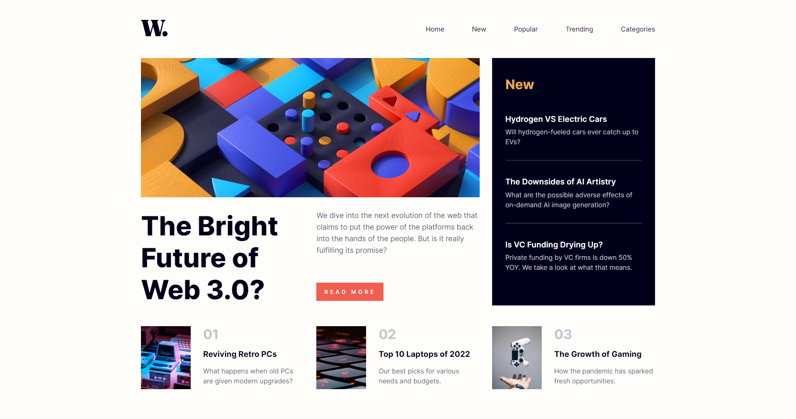
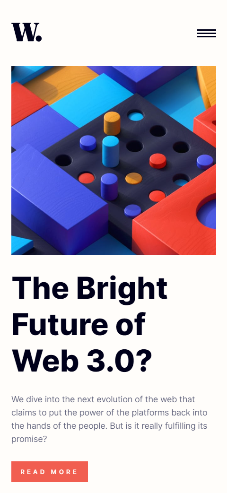
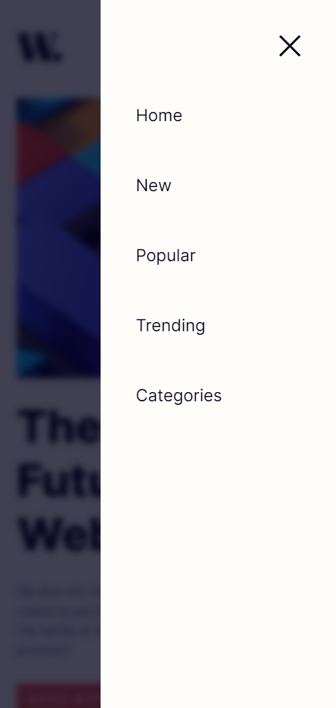

# Frontend Mentor - News homepage solution

This is a solution to the [News homepage challenge on Frontend Mentor](https://www.frontendmentor.io/challenges/news-homepage-H6SWTa1MFl). Frontend Mentor challenges help you improve your coding skills by building realistic projects.

 

## Table of contents

- [Overview](#overview)
  - [The challenge](#the-challenge)
  - [Screenshot](#screenshot)
  - [Links](#links)
- [My process](#my-process)
  - [Built with](#built-with)
  - [What I learned](#what-i-learned)
- [Author](#author)

## Overview

### The challenge

Users should be able to:

- View the optimal layout for the interface depending on their device's screen size
- See hover and focus states for all interactive elements on the page
- **Bonus**: Toggle the mobile menu (requires some JavaScript)

### Screenshot








### Links

- Solution URL: [Github Link](https://github.com/samzyconcepts/news-homepage)
- Live Site URL: [Live Preview](https://news-homepage-inky-delta.vercel.app/)

## My process

### Built with

- Semantic HTML5 markup
- CSS custom properties
- Flexbox
- CSS Grid


### What I learned

In this project I learnt how to use transform style and translateZ instead of using Z-index for plane positioning

```css
.proud-of-this-css {
  transform-style: preserve-3d;
  transform: translateZ(-1px);
}
```

## Author

-   Frontend Mentor - [@samzyconcepts](https://www.frontendmentor.io/profile/samzyconcepts)
-   Twitter - [@cre8veSam](https://www.twitter.com/cre8veSam) 🚀🚀🚀